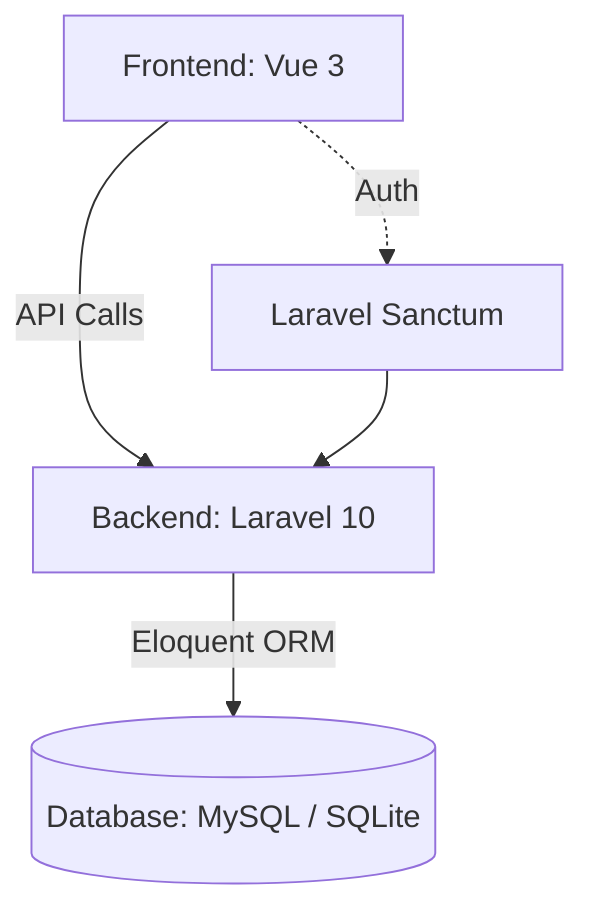

# 🌮 Kechow – Tu Guía Rápida al Antojo Local


[](https://opensource.org/licenses/MIT)
[](https://github.com/abimael92/kechow/pulls)
[](https://vuejs.org/)
[](https://laravel.com)

---

**Kechow** es una plataforma moderna que facilita la conexión entre las personas y la mejor comida local.
Rápida, fácil de usar y accesible desde cualquier dispositivo, diseñada para apoyar negocios locales y satisfacer antojos sin complicaciones.

---

## 🚀 Demo en Vivo

[](https://kechow.vercel.app)

---

## 🤔 ¿Por qué Kechow?

- Entregas rápidas como un perro lujurioso en tu pierna 🐕‍🔥
- Apoya negocios locales y comida con sabor auténtico
- App ligera, fácil para todos en Jiménez
- Backend en Laravel para un rendimiento sólido y seguro
- Frontend moderno con Vue 3 + Vite + TypeScript

---

## 🌟 Características Principales

- 🚀 App súper rápida construida con Vue 3 + Vite
- 🔒 Backend robusto con Laravel 10
- 📱 Diseño responsivo para cualquier dispositivo
- 🛒 Sistema completo de pedidos
- 📊 Dashboard para negocios locales
- 🔍 Búsqueda inteligente por tipo de comida

---

## 🛠 Stack Tecnológico

| Categoría         | Tecnologías                                  |
| ----------------- | -------------------------------------------- |
| **Frontend**      | Vue 3, Vite, TypeScript, Tailwind CSS, Pinia |
| **Backend**       | Laravel 10, PHP 8.1+                         |
| **Base de Datos** | MySQL/SQLite                                 |
| **Autenticación** | Laravel Sanctum                              |
| **Herramientas**  | Composer, npm, Vite                          |

---

## 📦 Estructura del Proyecto

```bash
kechow/
├── kechow-server/      # Backend (Laravel)
│   ├── app/            # Lógica de la aplicación
│   ├── database/       # Migraciones y seeders
│   └── routes/         # Definición de endpoints API
│
├── kechow-client/      # Frontend (Vue 3)
│   ├── src/
│   │   ├── features/   # Módulos funcionales
│   │   ├── stores/     # Gestión de estado
│   │   └── utils/      # Funciones auxiliares
│
└── package.json        # Scripts para desarrollo
```

---

## 🚀 Demo en Vivo (próximamente)

[](https://kechow.vercel.app)
[](https://api.kechow.dev/health)

---

## ⚙️ Configuración del Proyecto

### 📋 Requisitos del Sistema

| Componente    | Versión Requerida | Comando de Verificación |
| ------------- | ----------------- | ----------------------- |
| Node.js       | 18.x o superior   | `node -v`               |
| PHP           | 8.1+              | `php -v`                |
| Composer      | 2.0+              | `composer --version`    |
| Base de Datos | MySQL 5.7+/SQLite | `mysql --version`       |

### 🛠️ Instalación Paso a Paso

#### 1. Clonar el repositorio

```bash
git clone https://github.com/abimael92/kechow.git
cd kechow-main
```

##### 2. Instala dependencias

```
# Backend (Laravel)
composer install --working-dir=kechow-server

# Frontend (Vue)
npm install --prefix kechow-client

# Dependencias raíz (para scripts)
npm install
```

##### 3. Configuración de entorno

Es fundamental configurar correctamente los archivos de entorno para ambos proyectos:
Puedes usar el archivo de ejemplo `.env.example` para guiarte

###

```
npm run start

```

```
# Frontend
cp kechow-client/.env.example kechow-client/.env

# Backend
cp kechow-server/.env.example kechow-server/.env
php kechow-server/artisan key:generate
```

##### 4. Configurar base de datos

```
php kechow-server/artisan migrate --seed
```

##### 5. Ejecutar la aplicación

```
# Opción recomendada (Corre frontend y backend en paralelo)
npm run start


# Alternativa (servicios separados)
# Terminal 1:
php kechow-server/artisan serve
# Terminal 2:
npm run dev --prefix kechow-client
```

## 🛠️ Stack Tecnológico

### Frontend:

- **Vue 3** - Framework progresivo de JavaScript
- **Vite** - Herramientas frontend de última generación
- **TypeScript** - Superset de JavaScript con tipos
- **Pinia** - Gestión de estado
- **Tailwind CSS** - Framework CSS utility-first

### Backend:

- **Laravel 10** - Framework PHP para desarrollo web
- **PHP 8.1+** - Lenguaje de scripting del lado del servidor
- **Laravel Sanctum** - Autenticación para APIs

### Base de Datos:

- **MySQL** - Base de datos relacional
- **SQLite** - Alternativa ligera

### ❓ ¿Por qué este stack?

| Componente   | Beneficio                              |
| ------------ | -------------------------------------- |
| Vue 3 + Vite | Experiencia de desarrollo ultrarrápida |
| Laravel      | Backend robusto con sintaxis elegante  |
| Tailwind CSS | Desarrollo ágil de interfaces          |
| TypeScript   | Seguridad de tipos y mejor tooling     |
| MySQL/SQLite | Flexibilidad en despliegues            |

## 📊 Arquitectura del Sistema

Frontend (Vue 3) → Llamadas API → Backend (Laravel) → Base de Datos
↑
(Autenticación Sanctum)



# ✨ Funcionalidades

### 👨‍🍳 Para los usuarios:

- Ver y explorar restaurantes
- Buscar por tipo de comida
- Visualizar menú y hacer pedidos
- Búsqueda inteligente de restaurantes
- Sistema de pedidos integrado
- Diseño mobile-first
- Sistema de valoraciones

### 🍽️ Para dueños de negocios:

- Registrar su restaurante
- Administrar productos y pedidos
- Panel de administración
- Gestión de menú digital
- Seguimiento de pedidos
- Estadísticas básicas

# 📁 Estructura del Código

```
kechow-client/
├── features/          # Módulos principales como cart, menu, etc.
├── components/        # Componentes reutilizables
├── pages/             # Vistas de cada página
├── store/             # Pinia stores
├── styles/            # Tailwind y estilos globales
└── utils/             # Funciones auxiliares
```

```
kechow-server/
├── app/
│   ├── Http/
│   ├── Modules/       # Modularización por dominio
│   ├── Docs/          # Documentación API
│   └── Requests/      # Validaciones personalizadas
```

## 🤝 Contribuciones

¡Todos son bienvenidos! Abre un issue, haz un fork y manda tu PR.
Nos encanta la comida y el buen código 🍽️🧑‍💻

#### Cómo Contribuir?

    1. Haz fork del repositorio
    2. Crea una rama (`git checkout -b mi-feature`)
    3. Haz commit de tus cambios (`git commit -am 'Añade nueva feature'`)
    4. Haz push a la rama (`git push origin mi-feature`)
    5. Abre un Pull Request

## 🧯 Ayuda Rápida

¿Algo no funciona? Revisa tu .env, asegúrate que las migraciones corrieron correctamente y que el backend y frontend están corriendo.

¿Problemas con dependencias?

```
rm -rf node_modules && npm install
```

## ✅ Lista de funciones para la app de entrega Kechow

### 🏠 Inicio / Explorar

- [ ] Restaurantes destacados
- [ ] Filtros por categoría (Pizza, Tacos, Hamburguesas, etc.)
- [ ] Banners de promociones o sliders

### 🔍 Búsqueda

- [ ] Barra de búsqueda libre
- [ ] Sugerencias automáticas (autocomplete)
- [ ] Filtros/orden (por calificación, precio, tiempo de entrega)

### 🍽️ Detalle del restaurante

- [x] Información del restaurante, horarios, tiempo de entrega
- [ ] Menú agrupado por categorías
- [ ] Botón "Agregar al carrito" desde cada ítem
- [ ] Modificadores de ítem (extra queso, nivel de picante, etc.)

### 🛒 Carrito

- [ ] Lista de productos seleccionados
- [ ] Editar cantidad / eliminar
- [ ] Subtotal + envío + impuestos
- [ ] Botón de pagar

### 📍 Dirección de entrega

- [ ] Usar direcciones guardadas o ingresar nueva
- [ ] Marcador en mapa (opcional)

### 💳 Pago

- [ ] Selección de método de pago (tarjeta, efectivo, wallet)
- [ ] Confirmación del resumen del pedido

### 🚚 Seguimiento del pedido

- [ ] Estado en vivo del pedido (recibido, preparando, en camino)
- [ ] Vista de mapa con ubicación del repartidor (opcional)

### 📜 Historial de pedidos

- [ ] Lista de pedidos pasados
- [ ] Botón de reordenar
- [ ] Calificar/comentar pedidos anteriores

### 🙋‍♂️ Perfil

- [ ] Ver/editar datos personales
- [ ] Ver direcciones guardadas
- [ ] Métodos de pago
- [x] Cerrar sesión

### 🏷️ Promociones

- [ ] Ingreso y validación de código promocional
- [ ] Lista de ofertas disponibles

### 🛠️ Ajustes

- [ ] Preferencias de notificación
- [ ] Cambio de idioma / moneda
- [ ] Política de privacidad / Términos

---

### 🛠️ Paneles opcionales para restaurante/admin

#### 📊 Panel del restaurante

- [ ] Agregar/editar ítems del menú
- [ ] Ver pedidos entrantes
- [ ] Configurar horarios/disponibilidad

#### 🚦 Gestión de pedidos

- [ ] Aceptar / rechazar pedidos
- [ ] Marcar como preparando / listo / en camino

#### 👤 Gestión de usuarios (Admin)

- [ ] Bloquear cuentas
- [ ] Resolver disputas

## 🚧 Próximos Pasos

- Dashboard avanzado para negocios
- Notificaciones en tiempo real
- Versión móvil nativa
- Integración con pasarelas de pago

https://lottiefiles.com/free-animation/delivery-food-splash-N1rHOrHdTD
