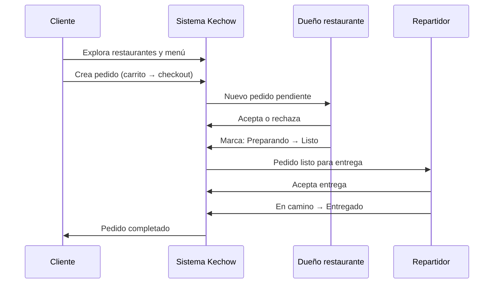
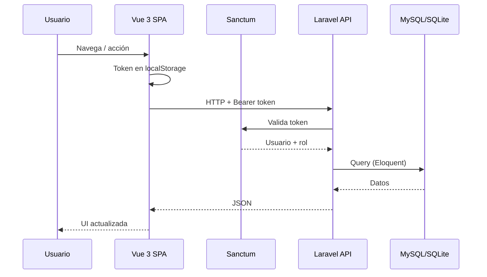
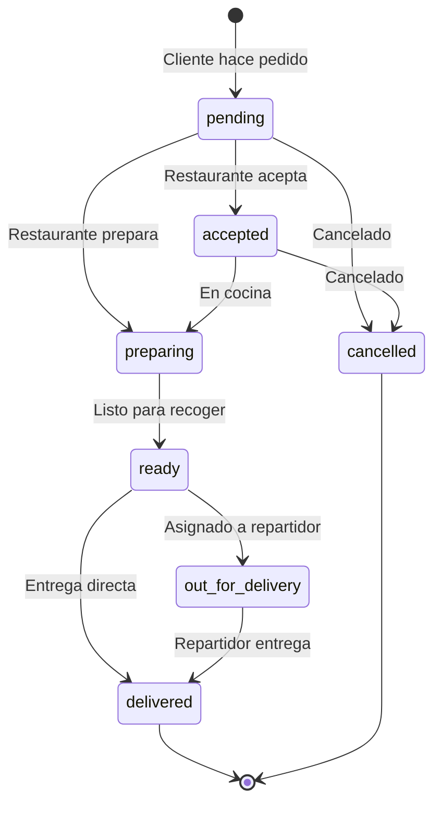

# Kechow – Tu Guía Rápida al Antojo Local


[](https://opensource.org/licenses/MIT)
[](https://github.com/abimael92/kechow/pulls)
[](https://vuejs.org/)
[](https://laravel.com)

---

**Kechow** es una plataforma moderna que facilita la conexión entre las personas y la mejor comida local. Rápida, fácil de usar y accesible desde cualquier dispositivo, diseñada para apoyar negocios locales y satisfacer antojos sin complicaciones.

---

## Descripción y Objetivo

**Problema:** En muchas localidades (p. ej. Jiménez) no existe una forma sencilla de descubrir restaurantes locales, ver menús y hacer pedidos desde un solo lugar. Los negocios carecen de una vitrina digital unificada.

**Objetivo:** Ofrecer una app única que una a clientes, dueños de restaurantes y repartidores: explorar restaurantes, gestionar menús y pedidos, y realizar entregas con una experiencia ágil y mantenible.

---

## Demo / Screenshots

| Vista | Descripción |
| ----- | ----------- |
| [Probar ahora](https://kechow.vercel.app) | Demo en vivo (frontend) |
| [Estado del API](https://api.kechow.dev/health) | Comprobación del backend |

Las imágenes de cabecera muestran la interfaz principal (front) y el panel de gestión (back). Se pueden añadir más capturas en esta sección (carrito, detalle de restaurante, panel de repartidor, etc.).

---

## Características Principales

- App construida con **Vue 3 + Vite + TypeScript** (rendimiento y tipado).
- Backend **Laravel 10** con API REST y autenticación **Laravel Sanctum**.
- Diseño **responsivo** y **mobile-first**.
- Sistema de **pedidos** con estados (recibido, preparando, en camino, entregado).
- **Dashboard para dueños**: menú, pedidos, reseñas, analíticas básicas, configuración.
- **Dashboard para repartidores**: pedidos disponibles, entregas en curso, ganancias.
- Búsqueda y exploración de restaurantes por categoría.
- Carrito, checkout y seguimiento de pedidos (flujo en desarrollo).
- Soporte **dark mode** y diseño consistente con Tailwind CSS.

---

## Roles de Usuario

| Rol | Descripción | Acceso principal |
| --- | ----------- | ----------------- |
| **Customer** | Cliente final | Explorar restaurantes, menú, carrito, pedidos, perfil. |
| **Owner** | Dueño de restaurante | Registrar y editar restaurantes, gestionar menú, ver y gestionar pedidos, reseñas, analíticas, ajustes. |
| **Delivery** | Repartidor | Ver pedidos asignados, aceptar/rechazar, marcar en camino/entregado, ganancias, perfil. |
| **Admin** | Administrador (backend) | Gestión de usuarios/owners (CRUD), resolución de disputas. |

El registro permite elegir rol (`customer`, `owner`, `delivery`). Los owners pueden asociar restaurantes al registrarse.

### Cómo interactúan los roles (flujo del pedido)

Cliente, dueño y repartidor colaboran en un mismo pedido; cada uno usa su propia vista en la app:



### Qué hace cada rol en la app (vistas y acciones)

Cada rol entra a un layout distinto y solo ve las pantallas permitidas para su rol:

```mermaid
flowchart TB
    subgraph Cliente["Cliente"]
        direction TB
        c1[Inicio / Restaurantes]
        c2[Detalle restaurante y menú]
        c3[Carrito]
        c4[Checkout]
        c5[Pedidos y seguimiento]
        c6[Perfil]
    end

    subgraph Dueño["Dueño de restaurante"]
        direction TB
        o1[Dashboard]
        o2[Menú y productos]
        o3[Pedidos entrantes]
        o4[Reseñas y analíticas]
        o5[Ajustes del negocio]
    end

    subgraph Repartidor["Repartidor"]
        direction TB
        d1[Dashboard]
        d2[Pedidos disponibles]
        d3[Entrega en curso]
        d4[Ganancias]
        d5[Perfil]
    end

    subgraph Admin["Admin (solo API)"]
        direction TB
        a1[CRUD owners/usuarios]
        a2[Resolución de disputas]
    end
```



### Resumen visual por rol

| Rol        | Entra por        | Interacción principal con…                          |
| ---------- | ---------------- | --------------------------------------------------- |
| **Cliente**   | `/home`, `/restaurants` | Restaurantes, menú, pedidos (crear y ver estado).   |
| **Dueño**     | `/owner/dashboard`     | Sus restaurantes, menú, pedidos (aceptar/preparar/listo). |
| **Repartidor** | `/delivery/dashboard`  | Pedidos listos (aceptar, en camino, entregado).     |
| **Admin**     | API (sin UI en front)   | Usuarios, owners, disputas.                         |

---

## Stack Tecnológico

| Categoría         | Tecnologías                                  |
| ----------------- | -------------------------------------------- |
| **Frontend**      | Vue 3, Vite, TypeScript, Tailwind CSS, Pinia, Vue Router, Vue I18n |
| **Backend**       | Laravel 10, PHP 8.1+                         |
| **Base de Datos** | MySQL / SQLite                               |
| **Autenticación** | Laravel Sanctum                              |
| **Herramientas**  | Composer, npm, ESLint, Prettier               |

---

## Arquitectura del sistema

Flujo de alto nivel:

**Frontend (Vue 3) → Llamadas API → Backend (Laravel) → Base de Datos**  
↑  
**(Autenticación Sanctum)**


**Flujo de una petición (autenticada):**



**Ciclo de vida del pedido (estados):**



---

## Requisitos Previos

| Componente    | Versión       | Comprobación        |
| ------------- | ------------- | ------------------- |
| Node.js       | 18.x o 20.x   | `node -v`           |
| npm           | 10.x          | `npm -v`            |
| PHP           | 8.1+          | `php -v`            |
| Composer      | 2.0+          | `composer --version`|
| Base de datos | MySQL 5.7+ o SQLite | `mysql --version` (si usas MySQL) |

---

## Instalación

### 1. Clonar el repositorio

```bash
git clone https://github.com/abimael92/kechow.git
cd kechow-main
```

### 2. Instalar dependencias

```bash
# Backend (Laravel)
composer install --working-dir=kechow-server

# Frontend (Vue)
npm install --prefix kechow-client

# Raíz (scripts con concurrently)
npm install
```

### 3. Configuración de entorno

**Backend:**

```bash
cp kechow-server/.env.example kechow-server/.env
php kechow-server/artisan key:generate
```

**Frontend:** Crear `kechow-client/.env` con al menos:

```env
VITE_API_URL=http://127.0.0.1:8000
```

Ajusta la URL si el backend corre en otro host/puerto.

### 4. Base de datos

```bash
php kechow-server/artisan migrate --seed
```

Con el seeder obtendrás usuarios de prueba (incl. owners con contraseña `123456`). Revisa `kechow-server/database/seeders/` para credenciales exactas.

### 5. Ejecutar la aplicación

**Opción recomendada (frontend y backend a la vez):**

```bash
npm run start
```

- Backend: http://127.0.0.1:8000  
- Frontend: http://127.0.0.1:5173 (Vite)

**Por separado:**

```bash
# Terminal 1 – Backend
cd kechow-server && php artisan serve

# Terminal 2 – Frontend
cd kechow-client && npm run dev
```

---

## Scripts y Comandos

**Raíz del monorepo:**

| Script   | Descripción                                      |
| -------- | ------------------------------------------------- |
| `npm run start` | Inicia backend (Laravel) y frontend (Vite) en paralelo |
| `npm run dev`   | Alias de `start`                                  |
| `npm run build` | Build de producción del frontend                  |
| `npm run lint`  | ESLint en `kechow-client`                         |
| `npm run format`| Prettier en `kechow-client`                       |
| `npm run test`  | Tests del cliente                                 |

**Solo frontend (`kechow-client/`):**

| Script            | Descripción                          |
| ----------------- | ------------------------------------ |
| `npm run dev`     | Servidor de desarrollo Vite          |
| `npm run build`   | Build para producción                |
| `npm run preview` | Vista previa del build (puerto 4173) |
| `npm run lint`    | ESLint (.ts, .vue)                   |
| `npm run typecheck` | Vue-tsc (sin emit)                 |
| `npm run format:check` | Prettier check                   |

**Solo backend (`kechow-server/`):**

```bash
php artisan serve          # Servidor HTTP
php artisan migrate --seed # Migraciones + seeders
php artisan config:clear   # Limpiar caché de config
```

---

## Estructura del Proyecto

```
kechow-main/
├── kechow-server/           # Backend Laravel
│   ├── app/
│   │   ├── Http/Controllers/ # Controladores API
│   │   ├── Modules/         # Módulos (Owner, Restaurant, etc.)
│   │   └── Models/         # Eloquent
│   ├── database/
│   │   ├── migrations/
│   │   └── seeders/
│   ├── routes/
│   │   └── api.php         # Rutas API
│   └── .env.example
│
├── kechow-client/          # Frontend Vue 3
│   ├── src/
│   │   ├── app/            # Router, store (auth), lib (axios, env), config
│   │   ├── features/       # Módulos: auth, business-owner, customer, delivery
│   │   ├── pages/          # Vistas por rol (customer, owner, delivery)
│   │   ├── shared/         # Layouts, componentes reutilizables
│   │   ├── assets/         # Imágenes, estilos globales, SVG
│   │   └── main.ts
│   ├── public/             # Favicon, logo, assets estáticos
│   └── vite.config.ts
│
├── Docs/                   # Documentación (arquitectura, integración, etc.)
├── package.json            # Scripts raíz (start, build, lint, test)
└── README.md
```

Cada **feature** en el cliente agrupa vistas, componentes, servicios y stores por dominio (auth, owner, customer, delivery).

---

## Configuración

### Variables de entorno

**Backend (`kechow-server/.env`):**

Las necesarias para desarrollo local:

| Variable     | Descripción           | Ejemplo              |
| ------------ | --------------------- | -------------------- |
| `APP_NAME`   | Nombre de la app      | `Kechow`             |
| `APP_KEY`    | Clave de cifrado      | Generada con `key:generate` |
| `APP_DEBUG`  | Modo debug            | `true` (solo desarrollo) |
| `VITE_API_URL` | URL pública del API (para assets) | `http://127.0.0.1:8000` |
| `FRONTEND_URL` | Origen del frontend (CORS) | `http://127.0.0.1:5173` |
| `DB_CONNECTION` | Driver de BD        | `mysql` o `sqlite`   |
| `DB_DATABASE` | Nombre de la BD       | `kechow`             |
| `DB_USERNAME` / `DB_PASSWORD` | Credenciales BD | Según entorno |

Para producción, configurar también `APP_ENV=production`, `APP_DEBUG=false` y credenciales seguras.

**Frontend (`kechow-client/.env`):**

| Variable       | Descripción        | Ejemplo              |
| -------------- | ------------------ | -------------------- |
| `VITE_API_URL` | URL base del API   | `http://127.0.0.1:8000` |

No commitear `.env`; usar `.env.example` como plantilla.

### Credenciales de ejemplo

Tras `php artisan migrate --seed`, los seeders crean usuarios de prueba. Los owners sembrados suelen usar contraseña `123456`. Revisa `kechow-server/database/seeders/OwnerSeeder.php` y `UserSeeder.php` para emails y roles exactos.

---

## Gestión de Assets

- **Imágenes públicas:** `kechow-client/public/images/` (favicon, logos, placeholders). Se referencian por ruta absoluta, p. ej. `/images/kechow_logo.png`.
- **Favicon:** Variantes en `public/images/favicon/` (ICO, PNG, webmanifest). Actualizar `index.html` y `site.webmanifest` si cambias rutas.
- **Assets por feature:** Imágenes o ilustraciones por módulo en `src/assets/` (p. ej. fotos de restaurantes, SVG). Importar desde componentes o estilos.
- **Iconos:** El proyecto usa **Heroicons** (`@heroicons/vue`) y **Lucide** (`lucide-vue-next`). SVG propios en `src/assets/svg/`.
- **Fuentes:** Inter y Chewy cargadas desde Google Fonts en `src/assets/styles/global.css`. No subir binarios de fuentes al repo salvo que se decida self-hosting.

---

## Estilo y UX

- **Sistema de diseño:** Tailwind CSS con tema extendido en `kechow-client/tailwind.config.js` y variables CSS en `src/assets/styles/global.css`.
- **Colores:**
  - **Primario:** `#FF6B00` (naranja Kechow), escala `primary-50`–`primary-950`.
  - **Secundario:** Grises para navegación y texto (`secondary-*`).
  - **Acento:** Teal/sky para highlights (`accent-*`). Delivery usa `driver-primary`, `driver-success`, `driver-warning`, `driver-error`.
  - **Semánticos:** `success`, `warning`, `error`, `info` (y variantes `-bg` / `-text` para badges).
- **Tipografía:** Inter (UI), Chewy (logo y títulos). Tamaños responsivos con `clamp` (hero, h1–h3).
- **Responsividad:** Mobile-first; breakpoints estándar de Tailwind. Botones y áreas táctiles mínimas ~44px.
- **Tema oscuro:** Clase `dark` en raíz; variables `--color-app-bg` y `--color-card` cambian en `.dark`. Componentes usan utilidades `dark:`.
- **Componentes:** Clases `.btn-primary`, `.btn-secondary` y bordes/radios (`rounded-button`, `rounded-card`, `rounded-input`) definidos en `global.css` y Tailwind.

Mantener consistencia usando las utilidades del tema y evitando colores hardcodeados.

---

## Limitaciones Actuales

- Muchas funcionalidades del flujo cliente están en desarrollo (carrito completo, checkout, pasarela de pago, direcciones guardadas, códigos promocionales).
- Seguimiento en tiempo real del repartidor (mapa en vivo) no implementado.
- Notificaciones push o en tiempo real (WebSockets) no integradas.
- Panel de administración (bloqueo de cuentas, disputas) expuesto vía API; sin UI de admin en el frontend.
- Algunos ítems del menú (modificadores, extras) pueden no estar cubiertos al 100%.
- i18n preparado (Vue I18n); cobertura de cadenas puede ser parcial.

---

## Buenas Prácticas Aplicadas

- **Frontend:** TypeScript estricto, componentes Vue 3 Composition API, Pinia para estado, rutas protegidas por rol (`requiresAuth`, `role`), lazy loading de rutas pesadas, alias de rutas (`@/`, `@features/`, etc.), ESLint + Prettier.
- **Backend:** API REST con Laravel, Sanctum para SPA, políticas y middlewares por rol, validación con Form Requests, módulos por dominio (Owner, Restaurant), migraciones versionadas y seeders documentados.
- **Seguridad:** CORS configurado, tokens Bearer, no loguear datos sensibles en producción, variables sensibles en `.env`.
- **Mantenibilidad:** Estructura por features, documentación en `Docs/`, configuración centralizada (app.config, env).

---

## Roadmap / Mejoras Futuras

- Restaurantes destacados, filtros por categoría, banners o sliders en inicio.
- Búsqueda con autocompletado y filtros (valoración, precio, tiempo de entrega).
- Menú agrupado por categorías, modificadores de ítem, carrito completo con envío e impuestos.
- Direcciones guardadas y selección en checkout; mapa opcional.
- Integración de pasarela de pago (tarjeta, efectivo, wallet).
- Seguimiento en vivo del pedido (estados y mapa del repartidor).
- Historial de pedidos con reordenar y valoraciones.
- Perfil: edición de datos, direcciones, métodos de pago.
- Códigos promocionales y ofertas.
- Ajustes: notificaciones, idioma, moneda, políticas legales.
- Panel restaurante: menú, pedidos entrantes, horarios y disponibilidad.
- Dashboard avanzado para negocios, notificaciones en tiempo real, versión móvil nativa.

---

## Contribuir

1. Haz fork del repositorio.
2. Crea una rama: `git checkout -b mi-feature`.
3. Commit: `git commit -am 'Añade nueva feature'`.
4. Push: `git push origin mi-feature`.
5. Abre un Pull Request.

Revisa que `npm run lint` y `npm run typecheck` pasen en el cliente. Para dudas o diseño, abre un issue.

---

## Ayuda Rápida

- **La app no arranca:** Comprueba que `.env` esté configurado en server y client, que las migraciones se hayan ejecutado y que backend (puerto 8000) y frontend (5173) estén en marcha.
- **Problemas de dependencias (frontend):** `cd kechow-client && rm -rf node_modules && npm install`.
- **CORS o 401:** Verifica `FRONTEND_URL` en el backend y que el frontend use la misma `VITE_API_URL` que el servidor que expone el API.

---

## Licencia

Este proyecto está bajo la licencia [MIT](https://opensource.org/licenses/MIT).

---

## Autor / Contacto

**Kechow** – [@abimael92](https://github.com/abimael92)

Repositorio: [https://github.com/abimael92/kechow](https://github.com/abimael92/kechow).

Para preguntas o propuestas, abre un issue o pull request.
